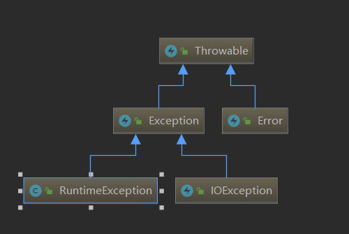

## 线程池
ThreadPoolExecutor类

### 重要属性  
ctl 高三位线程池状态信息、低29位保存线程池数量
works 等待执行的任务集合
corePoolSize 核心线程数
maximumPoolSize 线程池中最多能创建的线程数
threadFactory 创建线程的工厂
queue  缓存任务的阻塞队列（有界 无界LinkedBlockingQueue）
keepAliveTime 非核心线程失效时间
线程数量变化过程：创建一个线程
1. 线程池中线程数量小于核心线程数，创建线程
2. 线程池中线程数量大于核心线程数，队列没满进入队列，队列满，且线程数小于最大线程数，创建线程
3. 线程池中线程数量大于核心线程数，大于最大线程数，按照reject策略执行，默认抛出异常
### 常用线程池
```java
/**
* 固定长度线程池
* 初始化线程池个数与最大线程数相同
* 线程失效时间为0
* 线程等待队列无限长度队列
*/
public static ExecutorService newFixedThreadPool(int nThreads) {
    return new ThreadPoolExecutor(nThreads, nThreads,
                                  0L, TimeUnit.MILLISECONDS,
                                  new LinkedBlockingQueue<Runnable>());
}

/**
* 单个线程池
* 初始化线程池个数与最大线程数相同 都为1
* 线程失效时间为0
* 线程等待队列无限长度队列
*/
public static ExecutorService newSingleThreadExecutor() {
    return new FinalizableDelegatedExecutorService
        (new ThreadPoolExecutor(1, 1,
                                0L, TimeUnit.MILLISECONDS,
                                new LinkedBlockingQueue<Runnable>()));
}

/**
* 缓存线程池
* 初始化线程池个数为0 最大线程池线程数都为Integer.MAX_VALUE
* 线程失效时间为60
* 线程等待队列为单一队列
*/
public static ExecutorService newCachedThreadPool() {
    return new ThreadPoolExecutor(0, Integer.MAX_VALUE,
                                  60L, TimeUnit.SECONDS,
                                  new SynchronousQueue<Runnable>());
}


/**
* 调度线程池
* 初始化线程池个数为corePoolSize 最大线程池线程数都为Integer.MAX_VALUE
* 线程失效时间为0
* 线程等待队列为延迟队列
*/
public ScheduledThreadPoolExecutor(int corePoolSize,
                                   ThreadFactory threadFactory) {
    super(corePoolSize, Integer.MAX_VALUE, 0, NANOSECONDS,
          new DelayedWorkQueue(), threadFactory);
}


/**
* EagerThreadPoolExecutor
* 类似Tomcat线程池，dubbo中eager线程池的实现
* 当线程数超过核心线程数时，继续创建新的线程进行处理
* 当线程数超过最大线程数时，将线程压入任务队列中
* 重写workQueue实现，继承LinkedBlockingQueue
*/
public EagerThreadPoolExecutor(int corePoolSize,
                                   int maximumPoolSize,
                                   long keepAliveTime,
                                   TimeUnit unit, TaskQueue<Runnable> workQueue,
                                   ThreadFactory threadFactory,
                                   RejectedExecutionHandler handler) {
        super(corePoolSize, maximumPoolSize, keepAliveTime, unit, workQueue, threadFactory, handler);
    }
```


## 锁
### AbstractQueuedSynchronizer抽象队列同步器
属性参数，通过CAS控制state状态，从head为头，tail为尾的队列中获取、添加、删除工作任务执行
```java
/**
     * Head of the wait queue, lazily initialized.  Except for
     * initialization, it is modified only via method setHead.  Note:
     * If head exists, its waitStatus is guaranteed not to be
     * CANCELLED.
     */
    private transient volatile Node head;

    /**
     * Tail of the wait queue, lazily initialized.  Modified only via
     * method enq to add new wait node.
     */
    private transient volatile Node tail;

    /**
     * The synchronization state.
     */
    private volatile int state;
```
JDK中使用AbstractQueuedSynchronizer的有CountDownLatch、ReentrantLock、ReentrantReadWriteLock、Semaphore、ThreadPoolExecutor
### CountDownLatch
> A synchronization aid that allows one or more threads to wait until a set of operations being performed in other threads completes.
### CyclicBarrier
使用ReentrantLock实现


### ReentrantLock
那如何能保证每个线程都能拿到锁呢，队列FIFO是一个完美的解决方案，也就是先进先出，java的ReenTrantLock也就是用队列实现的公平锁和非公平锁。
在公平的锁中，如果有另一个线程持有锁或者有其他线程在等待队列中等待这个所，那么新发出的请求的线程将被放入到队列中。而非公平锁上，只有当锁被某个线程持有时，新发出请求的线程才会被放入队列中（此时和公平锁是一样的）。所以，它们的差别在于非公平锁会有更多的机会去抢占锁。
## 类加载


##Java异常

错误：
检查性异常：
运行时异常：由于程序编写错误造成，可以进行捕获也可以不捕获 


## 领域模型
领域模型（或称域模型；英语：domain model）可以被看作是一个系统的概念模型，用于以可视化的形式描述系统中的各个实体及其之间的关系。领域模型记录了一个系统中的关键概念和词汇表，显示出了系统中的主要实体之间的关系，并确定了它们的重要的方法和属性。
因此，对应于用例所描述的动态视图，领域模型提供了一种对整个系统的结构化的视图。领域模型的一个好处是描述并限制了系统边界。
领域模型的语义可以被用在源代码中，因此领域模型可以被应用在底层的软件开发阶段中。实体可以演化为类，方法和属性可以直接演化至代码之中。
在UML中，类图被用来描述领域模型。  
类之间的关系有继承（泛化：继承的逆过程）、关联、组合、聚合