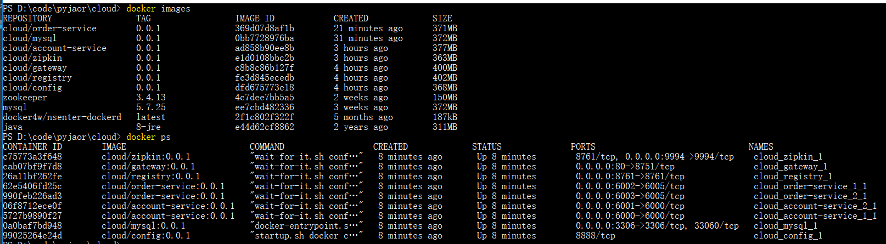

## 使用docker发布
### 逐一发布过程
```shell
#创建Docker镜像 注意WINDOWS与LINUX换行符不同
docker build -t cloud/config:0.0.1 .
docker build -t cloud/registry:0.0.1 .
docker build -t cloud/zipkin:0.0.1 .

#创建Docker容器
docker run -d --name cloud_config cloud/config:0.0.1
docker run -d --link=cloud_config:config --name cloud_registry -p 8761:8761 cloud/registry:0.0.1
docker run -d --link=cloud_config:config --name cloud_zipkin --link=cloud_registry:registry -p 9994:9994 cloud/zipkin:0.0.1
docker run -d --link=cloud_config:config --link=cloud_registry:registry --link=cloud_zipkin:zipkin --link=cloud_mysql:mysql --name=cloud_account_1 -p 6000:6000 cloud/account-service:0.0.1

#查看日志
docker logs --tail=100 cloud_registry

#8.0版本过高 使用5.0版本
docker run -d --name=cloud_mysql -e MYSQL_ROOT_PASSWORD=root -p 3306:3306 mysql:8.0.15
docker run -d --name=cloud_mysql -e MYSQL_ROOT_PASSWORD=root -p 3306:3306 mysql:5.7.25
docker exec -it cloud_mysql /bin/bash


docker rm `docker ps -a -q`
```

### 统一发布
```shell
#使用docker-compose编排 docker-compose.yml存在依赖问题，需要config实例完全启动
touch .env
echo "CONFIG_SERVICE_PASSWORD=cloud" <  .env
docker-compose up -d
```




### 根据docker-machine创建虚拟机
```shell
#node1
docker-machine.exe -s "E:\dockerimg\hyper" create  -d hyperv --hyperv-virtual-switch node node1
docker-machine.exe -s "E:\dockerimg\hyper" create  -d hyperv --hyperv-virtual-switch node node2
docker-machine.exe -s "E:\dockerimg\hyper" create  -d hyperv --hyperv-virtual-switch node node3
```