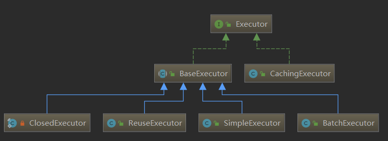
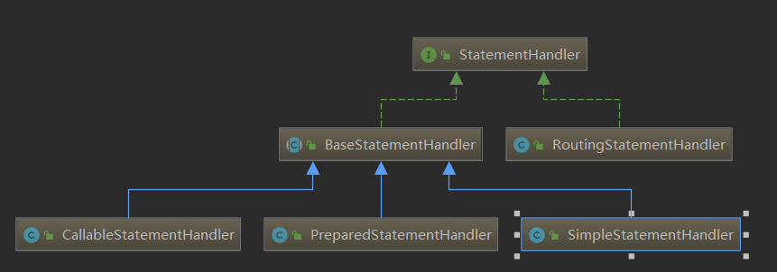

### mybatis执行流程
spring-boot、mybatis、druid分析一次查询请求过程

核心组件类：SqlSession SqlSessionFactory Executor
#### 1. 自动配置创建sqlSessionFactory与sqlSessionTemplate
类org.mybatis.spring.boot.autoconfigure.MybatisAutoConfiguration
项目启动时MybatisAutoConfiguration通过spring-boot的autoConfigure功能自动注册sqlSessionFactory与sqlSessionTemplate两个bean


```java

@Bean
  @ConditionalOnMissingBean
  public SqlSessionFactory sqlSessionFactory(DataSource dataSource) throws Exception {
    SqlSessionFactoryBean factory = new SqlSessionFactoryBean();
    factory.setDataSource(dataSource);
    factory.setVfs(SpringBootVFS.class);
    //读取配置文件中配置的Mapper类目录
    if (StringUtils.hasText(this.properties.getConfigLocation())) {
      factory.setConfigLocation(this.resourceLoader.getResource(this.properties.getConfigLocation()));
    }
    applyConfiguration(factory);
    if (this.properties.getConfigurationProperties() != null) {
      factory.setConfigurationProperties(this.properties.getConfigurationProperties());
    }
    if (!ObjectUtils.isEmpty(this.interceptors)) {
      factory.setPlugins(this.interceptors);
    }
    if (this.databaseIdProvider != null) {
      factory.setDatabaseIdProvider(this.databaseIdProvider);
    }
    if (StringUtils.hasLength(this.properties.getTypeAliasesPackage())) {
      factory.setTypeAliasesPackage(this.properties.getTypeAliasesPackage());
    }
    if (this.properties.getTypeAliasesSuperType() != null) {
      factory.setTypeAliasesSuperType(this.properties.getTypeAliasesSuperType());
    }
    if (StringUtils.hasLength(this.properties.getTypeHandlersPackage())) {
      factory.setTypeHandlersPackage(this.properties.getTypeHandlersPackage());
    }
    if (!ObjectUtils.isEmpty(this.properties.resolveMapperLocations())) {
      factory.setMapperLocations(this.properties.resolveMapperLocations());
    }

    return factory.getObject();
  }
  
  @Override
  public void registerBeanDefinitions(AnnotationMetadata importingClassMetadata, BeanDefinitionRegistry registry) {

    if (!AutoConfigurationPackages.has(this.beanFactory)) {
      logger.debug("Could not determine auto-configuration package, automatic mapper scanning disabled.");
      return;
    }

    logger.debug("Searching for mappers annotated with @Mapper");

    List<String> packages = AutoConfigurationPackages.get(this.beanFactory);
    if (logger.isDebugEnabled()) {
      packages.forEach(pkg -> logger.debug("Using auto-configuration base package '{}'", pkg));
    }

    ClassPathMapperScanner scanner = new ClassPathMapperScanner(registry);
    if (this.resourceLoader != null) {
      scanner.setResourceLoader(this.resourceLoader);
    }
    //扫描Mapper注解 添加Mapper
    scanner.setAnnotationClass(Mapper.class);
    scanner.registerFilters();
    scanner.doScan(StringUtils.toStringArray(packages));
 }
```

#### 2. 创建DefaultSqlSessionFactory DefaultSqlSession
SqlSessionFactoryBean加载mybatis的配置，创建生成DefaultSqlSessionFactory的sqlSessionFactory实例
sqlSessionFactory为DefaultSqlSessionFactory实例
SqlSessionTemplate继承SqlSession，并包含SqlSession的代理对象

```java
public SqlSessionTemplate(SqlSessionFactory sqlSessionFactory, ExecutorType executorType,
      PersistenceExceptionTranslator exceptionTranslator) {

    notNull(sqlSessionFactory, "Property 'sqlSessionFactory' is required");
    notNull(executorType, "Property 'executorType' is required");

    this.sqlSessionFactory = sqlSessionFactory;
    this.executorType = executorType;
    this.exceptionTranslator = exceptionTranslator;
    //生成sqlSessionProxy代理类
    this.sqlSessionProxy = (SqlSession) newProxyInstance(
        SqlSessionFactory.class.getClassLoader(),
        new Class[] { SqlSession.class },
        new SqlSessionInterceptor());
}
  

private class SqlSessionInterceptor implements InvocationHandler {
    @Override
    public Object invoke(Object proxy, Method method, Object[] args) throws Throwable {
      //创建SqlSession对象实例
      SqlSession sqlSession = getSqlSession(
          SqlSessionTemplate.this.sqlSessionFactory,
          SqlSessionTemplate.this.executorType,
          SqlSessionTemplate.this.exceptionTranslator);
      try {
        Object result = method.invoke(sqlSession, args);
        if (!isSqlSessionTransactional(sqlSession, SqlSessionTemplate.this.sqlSessionFactory)) {
          // force commit even on non-dirty sessions because some databases require
          // a commit/rollback before calling close()
          sqlSession.commit(true);
        }
        return result;
      } catch (Throwable t) {
        Throwable unwrapped = unwrapThrowable(t);
        if (SqlSessionTemplate.this.exceptionTranslator != null && unwrapped instanceof PersistenceException) {
          // release the connection to avoid a deadlock if the translator is no loaded. See issue #22
          closeSqlSession(sqlSession, SqlSessionTemplate.this.sqlSessionFactory);
          sqlSession = null;
          Throwable translated = SqlSessionTemplate.this.exceptionTranslator.translateExceptionIfPossible((PersistenceException) unwrapped);
          if (translated != null) {
            unwrapped = translated;
          }
        }
        throw unwrapped;
      } finally {
        if (sqlSession != null) {
          closeSqlSession(sqlSession, SqlSessionTemplate.this.sqlSessionFactory);
        }
      }
    }
}


public static SqlSession getSqlSession(SqlSessionFactory sessionFactory, ExecutorType executorType, PersistenceExceptionTranslator exceptionTranslator) {

    notNull(sessionFactory, NO_SQL_SESSION_FACTORY_SPECIFIED);
    notNull(executorType, NO_EXECUTOR_TYPE_SPECIFIED);

    //通过SqlSessionHolder对象保证同一事物中的查询处在同一个SqlSession中，并将sqlSession注册到本地线程变量TransactionSynchronizationManager.resources中
    SqlSessionHolder holder = (SqlSessionHolder) TransactionSynchronizationManager.getResource(sessionFactory);

    SqlSession session = sessionHolder(executorType, holder);
    if (session != null) {
      return session;
    }

    LOGGER.debug(() -> "Creating a new SqlSession");
    session = sessionFactory.openSession(executorType);

    //注册当前请求的session信息
    registerSessionHolder(sessionFactory, executorType, exceptionTranslator, session);

    return session;
}


private static void registerSessionHolder(SqlSessionFactory sessionFactory, ExecutorType executorType,
      PersistenceExceptionTranslator exceptionTranslator, SqlSession session) {
    SqlSessionHolder holder;
    if (TransactionSynchronizationManager.isSynchronizationActive()) {
      Environment environment = sessionFactory.getConfiguration().getEnvironment();
      //判断是否实现了Spring的事务管理功能
      if (environment.getTransactionFactory() instanceof SpringManagedTransactionFactory) {
        LOGGER.debug(() -> "Registering transaction synchronization for SqlSession [" + session + "]");

        holder = new SqlSessionHolder(session, executorType, exceptionTranslator);
        //绑定sqlSession信息到本地线程变量，下次直接获取，保证事务内操作处在同一个sqlSession中
        TransactionSynchronizationManager.bindResource(sessionFactory, holder);
        //
        TransactionSynchronizationManager.registerSynchronization(new SqlSessionSynchronization(holder, sessionFactory));
        holder.setSynchronizedWithTransaction(true);
        holder.requested();
      } else {
        if (TransactionSynchronizationManager.getResource(environment.getDataSource()) == null) {
          LOGGER.debug(() -> "SqlSession [" + session + "] was not registered for synchronization because DataSource is not transactional");
        } else {
          throw new TransientDataAccessResourceException(
              "SqlSessionFactory must be using a SpringManagedTransactionFactory in order to use Spring transaction synchronization");
        }
      }
    } else {
      LOGGER.debug(() -> "SqlSession [" + session + "] was not registered for synchronization because synchronization is not active");
    }

}


//事务同步管理器
public abstract class TransactionSynchronizationManager {

    //保存事务sqlSession信息
	private static final ThreadLocal<Map<Object, Object>> resources =
			new NamedThreadLocal<>("Transactional resources");

    //事务同步协调器
	private static final ThreadLocal<Set<TransactionSynchronization>> synchronizations =
			new NamedThreadLocal<>("Transaction synchronizations");

	private static final ThreadLocal<String> currentTransactionName =
			new NamedThreadLocal<>("Current transaction name");

	private static final ThreadLocal<Boolean> currentTransactionReadOnly =
			new NamedThreadLocal<>("Current transaction read-only status");

	private static final ThreadLocal<Integer> currentTransactionIsolationLevel =
			new NamedThreadLocal<>("Current transaction isolation level");

	private static final ThreadLocal<Boolean> actualTransactionActive =
			new NamedThreadLocal<>("Actual transaction active");
}
```

#### 3. 获取MapperProxy
Mybatis通过Spring容器进行管理时，每次请求Spring都会使用SqlSessionTemplate创建SqlSession的代理类执行具体的数据库操作
SqlSessionTemplate同时实现SqlSession接口

```java
//SqlSessionTemplate通过配置获取具体执行的MapperProxy对象
@Override
 public <T> T getMapper(Class<T> type) {
   return getConfiguration().getMapper(type, this);
}
//Mybatis Configuration对象
public <T> T getMapper(Class<T> type, SqlSession sqlSession) {
  return mapperRegistry.getMapper(type, sqlSession);
}
//MapperRegistry对象
public <T> T getMapper(Class<T> type, SqlSession sqlSession) {
    //MapperProxy最终由MapperProxyFactory生成
    final MapperProxyFactory<T> mapperProxyFactory = (MapperProxyFactory<T>) knownMappers.get(type);
    if (mapperProxyFactory == null) {
      throw new BindingException("Type " + type + " is not known to the MapperRegistry.");
    }
    try {
      return mapperProxyFactory.newInstance(sqlSession);
    } catch (Exception e) {
      throw new BindingException("Error getting mapper instance. Cause: " + e, e);
    }
  }
```

#### 4. MapperProxy执行过程
MapperProxy将执行的具体操作交给MapperMethod

```java
@Override
  public Object invoke(Object proxy, Method method, Object[] args) throws Throwable {
    try {
      if (Object.class.equals(method.getDeclaringClass())) {
        return method.invoke(this, args);
      } else if (isDefaultMethod(method)) {
        return invokeDefaultMethod(proxy, method, args);
      }
    } catch (Throwable t) {
      throw ExceptionUtil.unwrapThrowable(t);
    }
    final MapperMethod mapperMethod = cachedMapperMethod(method);
    return mapperMethod.execute(sqlSession, args);
  }
```
MapperMethod再根据不同的操作类型调用SqlSession中的数据库操作方法
```java
public Object execute(SqlSession sqlSession, Object[] args) {
    Object result;
    switch (command.getType()) {
       //插入
      case INSERT: {
    	Object param = method.convertArgsToSqlCommandParam(args);
        result = rowCountResult(sqlSession.insert(command.getName(), param));
        break;
      }
      //更新
      case UPDATE: {
        Object param = method.convertArgsToSqlCommandParam(args);
        result = rowCountResult(sqlSession.update(command.getName(), param));
        break;
      }
      //删除
      case DELETE: {
        Object param = method.convertArgsToSqlCommandParam(args);
        result = rowCountResult(sqlSession.delete(command.getName(), param));
        break;
      }
      //查询
      case SELECT:
        if (method.returnsVoid() && method.hasResultHandler()) {
          executeWithResultHandler(sqlSession, args);
          result = null;
        } else if (method.returnsMany()) {
          result = executeForMany(sqlSession, args);
        } else if (method.returnsMap()) {
          result = executeForMap(sqlSession, args);
        } else if (method.returnsCursor()) {
          result = executeForCursor(sqlSession, args);
        } else {
          Object param = method.convertArgsToSqlCommandParam(args);
          result = sqlSession.selectOne(command.getName(), param);
          if (method.returnsOptional() &&
              (result == null || !method.getReturnType().equals(result.getClass()))) {
            result = Optional.ofNullable(result);
          }
        }
        break;
       //批量处理
      case FLUSH:
        result = sqlSession.flushStatements();
        break;
      default:
        throw new BindingException("Unknown execution method for: " + command.getName());
    }
    if (result == null && method.getReturnType().isPrimitive() && !method.returnsVoid()) {
      throw new BindingException("Mapper method '" + command.getName()
          + " attempted to return null from a method with a primitive return type (" + method.getReturnType() + ").");
    }
    return result;
  }
```
#### 5. Executor执行
DefaultSqlSession将数据库的增删改查JDBC操作交给Executor执行
Executor类型


#### 6. StatementHandler执行
Executor由配置创建StatementHandler
StatementHandler继承BaseStatementHandler抽象类


```java
@Override
  public <E> List<E> doQuery(MappedStatement ms, Object parameter, RowBounds rowBounds, ResultHandler resultHandler, BoundSql boundSql) throws SQLException {
    Statement stmt = null;
    try {
      Configuration configuration = ms.getConfiguration();
      //创建处理Handler
      StatementHandler handler = configuration.newStatementHandler(wrapper, ms, parameter, rowBounds, resultHandler, boundSql);
      stmt = prepareStatement(handler, ms.getStatementLog());
      return handler.query(stmt, resultHandler);
    } finally {
      closeStatement(stmt);
    }
  }
  
  //BaseStatementHandler
  protected BaseStatementHandler(Executor executor, MappedStatement mappedStatement, Object parameterObject, RowBounds rowBounds, ResultHandler resultHandler, BoundSql boundSql) {
      this.configuration = mappedStatement.getConfiguration();
      this.executor = executor;
      this.mappedStatement = mappedStatement;
      this.rowBounds = rowBounds;
  
      this.typeHandlerRegistry = configuration.getTypeHandlerRegistry();
      this.objectFactory = configuration.getObjectFactory();
  
      if (boundSql == null) { // issue #435, get the key before calculating the statement
        generateKeys(parameterObject);
        boundSql = mappedStatement.getBoundSql(parameterObject);
      }
  
      this.boundSql = boundSql;
      //创建请求参数处理器
      this.parameterHandler = configuration.newParameterHandler(mappedStatement, parameterObject, boundSql);
      //创建返回值处理器
      this.resultSetHandler = configuration.newResultSetHandler(executor, mappedStatement, rowBounds, parameterHandler, resultHandler, boundSql);
    }
    
    //DefaultResultSetHandler
    @Override
      public List<Object> handleResultSets(Statement stmt) throws SQLException {
        ErrorContext.instance().activity("handling results").object(mappedStatement.getId());
    
        final List<Object> multipleResults = new ArrayList<>();
    
        int resultSetCount = 0;
        ResultSetWrapper rsw = getFirstResultSet(stmt);
    
        //获取xml文件中的resultMap块
        List<ResultMap> resultMaps = mappedStatement.getResultMaps();
        int resultMapCount = resultMaps.size();
        validateResultMapsCount(rsw, resultMapCount);
        while (rsw != null && resultMapCount > resultSetCount) {
          ResultMap resultMap = resultMaps.get(resultSetCount);
          //数据库返回结果与resultMaps对应解析
          handleResultSet(rsw, resultMap, multipleResults, null);
          rsw = getNextResultSet(stmt);
          //清处处理完成的数据库返回结果集
          cleanUpAfterHandlingResultSet();
          resultSetCount++;
        }
    
        //当前不存在resultMap，调用parentResultMap进行处理
        String[] resultSets = mappedStatement.getResultSets();
        if (resultSets != null) {
          while (rsw != null && resultSetCount < resultSets.length) {
            ResultMapping parentMapping = nextResultMaps.get(resultSets[resultSetCount]);
            if (parentMapping != null) {
              String nestedResultMapId = parentMapping.getNestedResultMapId();
              ResultMap resultMap = configuration.getResultMap(nestedResultMapId);
              handleResultSet(rsw, resultMap, null, parentMapping);
            }
            rsw = getNextResultSet(stmt);
            cleanUpAfterHandlingResultSet();
            resultSetCount++;
          }
        }
    
        return collapseSingleResultList(multipleResults);
      }
      
private void handleResultSet(ResultSetWrapper rsw, ResultMap resultMap, List<Object> multipleResults, ResultMapping parentMapping) throws SQLException {
    try {
      if (parentMapping != null) {
        handleRowValues(rsw, resultMap, null, RowBounds.DEFAULT, parentMapping);
      } else {
        if (resultHandler == null) {
          DefaultResultHandler defaultResultHandler = new DefaultResultHandler(objectFactory);
          handleRowValues(rsw, resultMap, defaultResultHandler, rowBounds, null);
          multipleResults.add(defaultResultHandler.getResultList());
        } else {
          //最后由getRowValue执行结果集映射
          handleRowValues(rsw, resultMap, resultHandler, rowBounds, null);
        }
      }
    } finally {
      // issue #228 (close resultsets)
      closeResultSet(rsw.getResultSet());
    }
  }
  
  
  private Object getRowValue(ResultSetWrapper rsw, ResultMap resultMap, String columnPrefix) throws SQLException {
      final ResultLoaderMap lazyLoader = new ResultLoaderMap();
      Object rowValue = createResultObject(rsw, resultMap, lazyLoader, columnPrefix);
      if (rowValue != null && !hasTypeHandlerForResultObject(rsw, resultMap.getType())) {
        final MetaObject metaObject = configuration.newMetaObject(rowValue);
        boolean foundValues = this.useConstructorMappings;
        if (shouldApplyAutomaticMappings(resultMap, false)) {
          //结果集根据规则自动映射到字段
          foundValues = applyAutomaticMappings(rsw, resultMap, metaObject, columnPrefix) || foundValues;
        }
        foundValues = applyPropertyMappings(rsw, resultMap, metaObject, lazyLoader, columnPrefix) || foundValues;
        foundValues = lazyLoader.size() > 0 || foundValues;
        rowValue = foundValues || configuration.isReturnInstanceForEmptyRow() ? rowValue : null;
      }
      return rowValue;
    }
    
    
  
  private boolean applyAutomaticMappings(ResultSetWrapper rsw, ResultMap resultMap, MetaObject metaObject, String columnPrefix) throws SQLException {
    //创建UnMappedColumnAutoMapping对象
    List<UnMappedColumnAutoMapping> autoMapping = createAutomaticMappings(rsw, resultMap, metaObject, columnPrefix);
    boolean foundValues = false;
    if (!autoMapping.isEmpty()) {
      for (UnMappedColumnAutoMapping mapping : autoMapping) {
         //使用mybatis默认注册的TypeHandler进行数据库类型与JAVA类型转换 由TypeHandlerRegistry管理
        final Object value = mapping.typeHandler.getResult(rsw.getResultSet(), mapping.column);
        if (value != null) {
          foundValues = true;
        }
        if (value != null || (configuration.isCallSettersOnNulls() && !mapping.primitive)) {
          // gcode issue #377, call setter on nulls (value is not 'found')
          metaObject.setValue(mapping.property, value);
        }
      }
    }
    return foundValues;
  }
```
#### 7. 缓存


